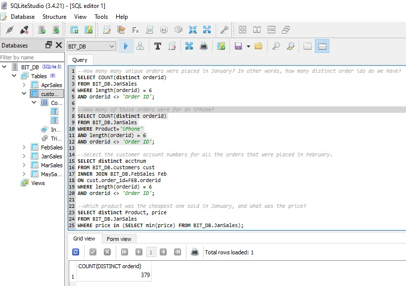
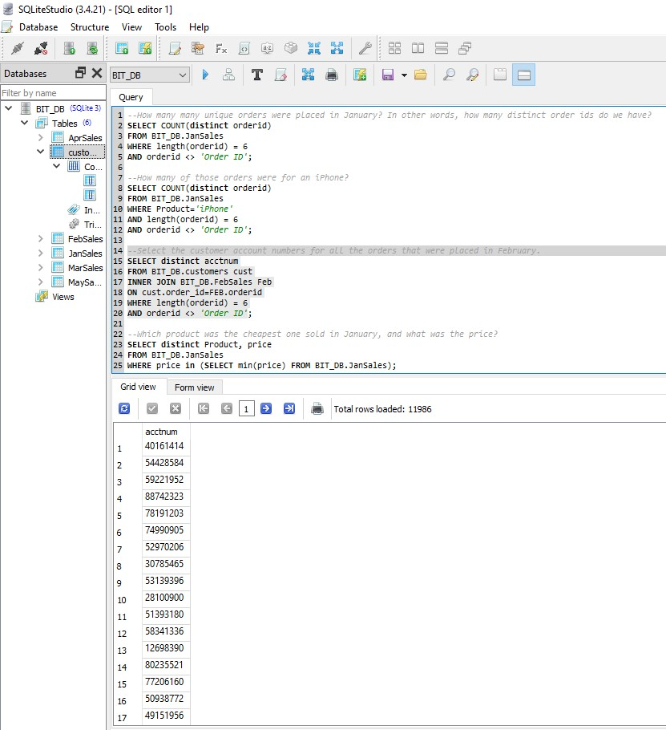
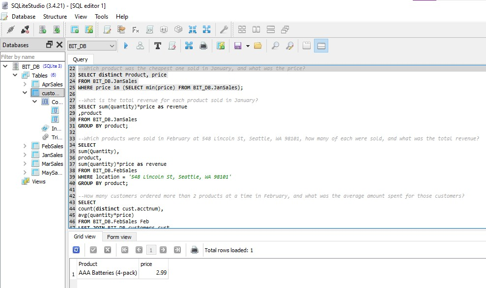
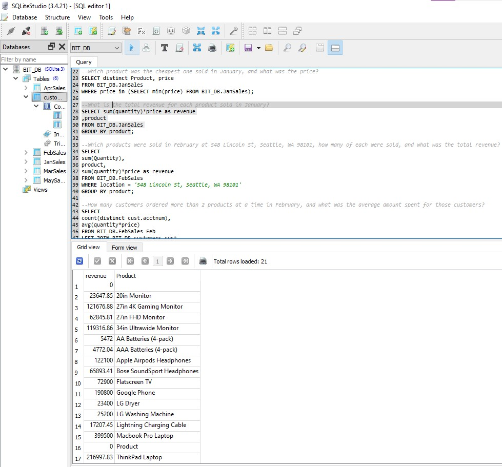
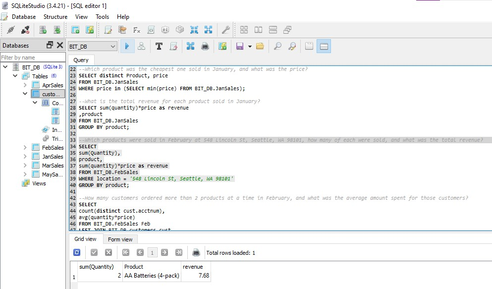
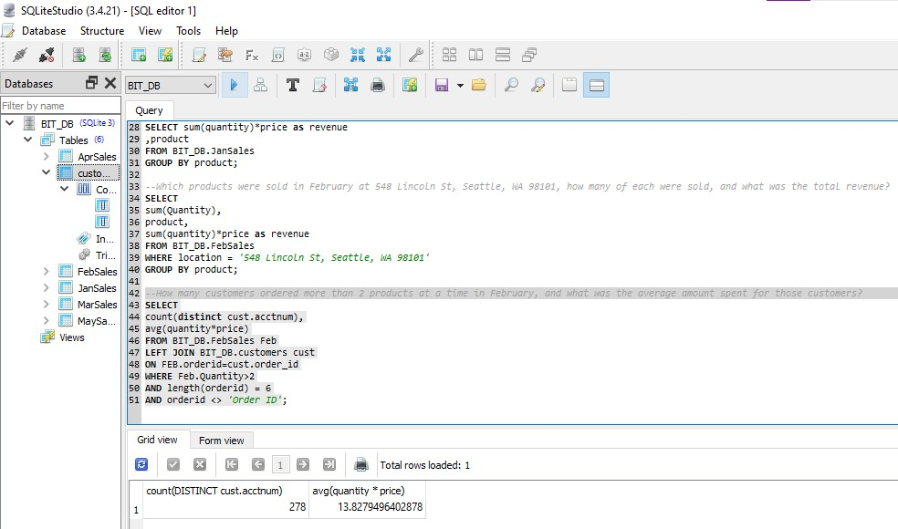

1. How many many unique orders were placed in January? In other words, how many distinct order ids do we have?
SELECT COUNT(distinct orderid)
FROM BIT_DB.JanSales
WHERE length(orderid) = 6
AND orderid <> 'Order ID';

